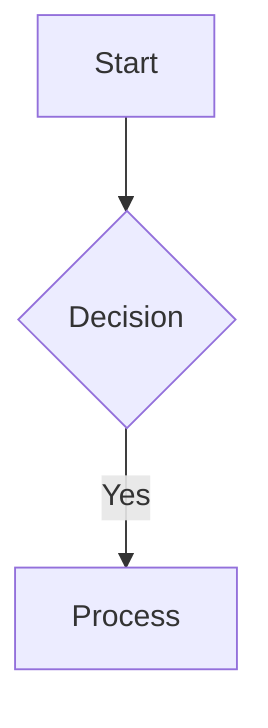

# Features

A guided tour of every feature in VaultReader, with the syntax / shortcut to invoke each.

## Reading

### Vault browser
Each subdirectory of the mounted `/vaults` path is a separate vault. The sidebar shows them as icons (top row) — click one to enter. Custom icons go in `appdata/icons/<vault>.{png,svg,jpg,webp}` and are picked up live (no restart).

The sidebar then shows a file-commander style listing for the current directory: folders first (alphabetical), then notes. Click a folder to enter it; click a note to open. Drag the right edge of the sidebar to resize (180–600px); double-click the handle to reset.

### Wikilinks
Standard Obsidian syntax:
- `[[note]]` — links to `note.md` in the current vault.
- `[[note|Custom label]]` — same target, different display text.
- `[[note#heading]]` — link to a heading anchor.
- `[[note^block]]` — link to a block reference (rendered as plain link, no targeting).

Resolution prefers the current vault, then falls back to other vaults (compound key lookup). If a wikilink doesn't resolve, it renders as a "broken link" span you can click to create the missing note.

### Image embeds
- `![[image.png]]` — embed by basename (vault-wide search).
- `![[subdir/image.png]]` — embed by note-relative path.
- `![[full/path/from/vault/root/image.png]]` — embed by vault-relative path.

The renderer rewrites these to `` automatically.

### Backlinks
Toolbar icon (chain-link, top-right). Opens an overlay drawer listing every note in the active vault that links to the current one, with an excerpt of the surrounding context. The badge on the icon shows the count.

### Outline / table of contents
Toolbar icon (three-line list). Opens a 220px right rail with `h1`/`h2`/`h3` headings parsed from the rendered note. The active heading highlights as you scroll. Click any heading to smooth-scroll to it. Hidden when the note has no headings; pane state persists per-browser. On screens ≤900px, the pane becomes a fixed-position overlay.

### Note properties
Above the (collapsible) frontmatter section: a one-line strip showing **size · modified (relative; absolute on hover) · word count · outgoing wikilinks · backlinks**. Word count strips frontmatter and code blocks before counting.

### Frontmatter chips
Frontmatter values render below the toggle button. **Array values** (e.g. `tags: [foo, bar]`) and **scalars under tag-like keys** (`tags`, `aliases`, `category`, `categories`, `status`, `topic`, `topics`, `project`, `tag`, `alias`) become rounded chip buttons. Click any chip → opens the search overlay pre-populated with the chip's value.

Non-tag scalars (e.g. `title`, `created`, `public: true`) render as plain text.

### Mermaid diagrams
Fenced code blocks tagged `mermaid` are rendered to SVG client-side via Mermaid v11. Supported: flowchart, sequence, gantt, pie, block, state, class, ER, mindmap, etc. The editor toolbar's 📊 button has a dropdown with five starter scaffolds (flowchart / sequence / gantt / pie / block).



### KaTeX math
Bare `$…$` is **not** consumed (currency conflicts: `costs $5 and $10` would false-match). Use:
- `$$expr$$` — block math.
- `\(expr\)` — inline math.
- `\[expr\]` — alternative block syntax (caveat: goldmark may eat the leading `\` in some contexts; prefer `$$…$$`).

Bad math renders in the accent color rather than throwing.

### Mobile
Sidebar slides in from the left with a scrim backdrop. Toolbar shrinks but stays full-width. Editor toolbar hides under 700px to keep the editor usable. Outline pane becomes a full-width overlay under 700px and auto-closes on heading click.

## Editing

### Edit toggle
Press `E` (no modifier) anywhere outside an input, or click the pencil/eye icon in the toolbar. Switches between rendered preview and CodeMirror 6 editor.

Editor features:
- Line wrapping
- Markdown syntax highlighting (with `oneDark` theme in dark mode)
- Line numbers
- Standard CodeMirror keybindings + `Tab` to indent
- Autosave every 1.5s after typing stops; status indicator at top-right (`Saving… / ✓ Saved / ✗ Error`)
- Conflict-aware save — see "Conflict resolution" below

### Toolbar
14 buttons above the editor:

| Group | Buttons |
|---|---|
| Inline marks | **B**old, *I*talic, ~~strikethrough~~ |
| Block prefixes | **H**eading (cycles 1→2→3→none), bullet list, numbered list, task list, quote |
| Code | inline code (`` ` ``), code block (` ``` `), table (3×3 GFM) |
| Links | hyperlink, wikilink |
| Mermaid | dropdown with 5 starter diagrams |

All buttons are selection-aware: with a selection they wrap or prefix it; with no selection they insert syntax and place the cursor where you'd type next.

### Wikilink autocomplete
Type `[[` in the editor → popup appears below the cursor with up to 8 search results. Arrow keys + Enter to insert; `]` typed by user dismisses. Suppressed inside fenced code blocks.

The popup hits `/api/search?vault=<active>&q=<typed>` with a 150ms debounce. Inserting a result yields `[[vault-relative-path]]` (no `.md` suffix — matches what the renderer expects).

### Paste / drop image upload
Paste an image from the clipboard or drag-drop one onto the editor. The image uploads to `<note-dir>/attachments/<note-base>-<unix>.<ext>` via `POST /api/upload`. While uploading, a `![[uploading-<ts>]]` placeholder sits at the cursor; on success it's replaced with `![[attachments/<filename>]]`.

**Preview-mode paste also works**: paste an image while reading (no edit toggle needed). The upload runs, the embed gets appended at end of the note's raw markdown, the file saves with conflict detection, and the preview re-renders. Convenient for "I'm reading and want to drop in a screenshot" without breaking flow.

Reuses the same `isWritable` + `safePath` guards as note PUTs. Caps body at 10MB. Accepts `image/{png,jpeg,gif,webp,svg+xml}`. Files in unwritable paths return 403, surfaced via a modal.

### Save normalization
On every save, the backend applies two harmless cleanups:
- Strip trailing whitespace from every line.
- Ensure exactly one trailing newline.

This eliminates a common source of git-diff noise when the same vault is edited from multiple tools. Internal blank lines are preserved (markdown semantics).

### Note templates
Drop `.md` files into `<vault>/templates/`. They appear in the toolbar's `+ New` menu under "From template…". Selecting one prompts for a new note name; the template's body is then expanded with these placeholders before creation:

| Placeholder | Replaced with |
|---|---|
| `{{date}}` | `YYYY-MM-DD` (today, local time) |
| `{{date:FMT}}` | Custom format using `YYYY MM DD HH mm ss` tokens |
| `{{time}}` | `HH:mm` |
| `{{title}}` | The new note's name |

The new note opens in edit mode with the cursor at end of file. Templates that use Obsidian's Templater syntax (`<% tp.date.now(...) %>`) are not expanded — they render literally. Use the placeholder syntax above for VaultReader-aware templates.

### Rename warning
Renaming a note also breaks any `[[wikilinks]]` that point to it (VaultReader does not auto-rewrite linking notes). Before showing the rename input, the app fetches the backlink list. If anything links to the note, a danger modal appears listing up to 5 affected note titles with a "Rename anyway" button. Notes with zero incoming links skip the warning entirely.

### Conflict-aware writes
On save, the client sends `?ifMTime=<last-known-mtime>` along with the body. If the file on disk is newer (with 1-second slop for second-precision filesystems), the server returns **409 Conflict** with the disk version's content + mtime in the body.

The client surfaces a danger modal:
- **Cancel** — keep editing locally, don't save.
- **Take theirs** — replace the editor with the disk copy (your unsaved edits are lost).
- **Keep mine (overwrite)** — retry the save with the conflict check disabled.

This protects against silent overwrites when Syncthing brings in changes from another device while you're editing on the web.

## Search & discovery

### Search overlay
`Ctrl/⌘+K` or `/` opens. Capped at 20 results per vault. Shows path, title (first H1), and an excerpt around the first body match. Image attachments matching the query also appear with a 🖼 prefix; click them to open the file in a new tab.

**Ranking:**
| Match type | Score |
|---|---|
| Exact title equals query | +20 |
| Substring in title | +10 |
| Substring in filename basename | +5 |
| Per body occurrence (capped at 5) | +1 |
| Recency (modified within 30 days, linear) | +0–3 |

Top 20 by score per vault.

**Operators**: combine plain text with structured filters. Operators AND together; plain text after acts as the body substring filter.

| Operator | Example | Meaning |
|---|---|---|
| `tag:` | `tag:work` | Frontmatter tags contain `work` (substring + hierarchical match: `tag:london` catches `london-2026` and `london/places`) |
| `path:` | `path:viagens` | Vault-relative path contains `viagens` |
| `title:` | `title:plan` | First-H1 title contains `plan` |
| `modified:` | `modified:>7d` | Modified within last 7 days. Also `<30d`, `>2026-01-01`, `<2026-01-01`, `=2026-04-29` |

Operator-only queries (e.g. `tag:work modified:>7d`) return all matches sorted by recency.

The placeholder text in the search input shows operator hints.

### Saved searches
Type a query → click "★ Save" → modal asks for a name (default = the query). Up to 30 saved queries kept (LIFO; deduped by name) in `localStorage['vr-saved-searches']`. Empty-state of the search overlay shows the saved list with click-to-run. Saved searches with operators work just like any other query string.

### Tag pane
Toolbar icon (price-tag). Opens a 600px overlay listing every frontmatter tag across all vaults, sorted by count desc. Filter input narrows the cloud live. Click any tag → closes the pane and opens search with that tag as the query. Tooltip shows which vaults the tag appears in.

Currently aggregates `tags:` and `tag:` keys from frontmatter only — inline `#tag` syntax is not yet detected.

### Graph view
Toolbar icon (three-circles). Full-screen overlay with a force-directed graph powered by Cytoscape + the `cola` layout (live continuous simulation — drag a node and the rest reflows in real time, settles a couple of seconds after release). Each node is a note; each edge is a wikilink.

**Three scopes**, picked automatically by the toolbar icon based on what's open:
- **All vaults** — no filter.
- **Single vault** — `?vault=X`.
- **Folder** — `?vault=X&folder=path/to/folder`. Only notes whose vault-relative path is under that folder.
- **Ego graph** — `?center=vault:path&depth=N` (1–5). The center note plus everyone within N hops via outbound + inbound wikilinks. Center node renders larger with a thick accent ring.

A scope breadcrumb at the top of the overlay lets you click to widen (e.g. ego → folder → vault → all). In ego mode, depth ± buttons appear next to the breadcrumb.

**Interactions:**
- Plain click on a node → close graph, open the note.
- Shift-click → re-center the graph there (stays open).
- Cmd/Ctrl-click → open in new tab.
- Hover → light up the connected neighborhood (rest fades to 0.12).
- Drag → ripple the graph; cola continues simulating for ~1.5–3.5s after release.

**Visual rules:**
- Default node size is 5–14px, scaled by incoming reference count; default fill is the page background with a thin border.
- Nodes with `refs > 0` get the accent fill.
- Labels are hidden by default — only visible when zoom is high enough that the rendered font is readable, plus the center node and any hovered/lit nodes always show their label.
- Edges are unbundled-bezier curves at 0.55 opacity; `.lit` ones (in the hovered neighborhood) brighten to accent color.

### Daily notes
`Ctrl/⌘+D` → opens or creates `daily/YYYY-MM-DD.md` in the active vault. Fresh ones get a minimal `# YYYY-MM-DD` template AND **drop you into edit mode with the cursor at end of file** — the common "open today's daily and start typing" workflow is one keystroke. Existing dailies open in preview as before.

### Visit history navigation
`Alt + ←` / `Alt + →` → back / forward through previously-opened notes. Wraps the browser's native `history.back/forward`. Skipped when focus is in a text input or the editor (so Alt+← still does word-jump there).

### Reveal in sidebar
`Ctrl/⌘ + Shift + L`, or right-click any wikilink in preview → "Reveal in sidebar". Switches the sidebar to the active note's vault, navigates `cwd` to the note's parent folder, and smooth-scrolls the row into view.

### Wikilink context menu
Right-click any `[[wikilink]]` in the preview pane:
- **Open** — open the target note.
- **Open in new tab** — middle-click equivalent.
- **Reveal in sidebar** — see above.
- **Copy wikilink** — copies `[[name]]` to clipboard.
- **Copy URL** — copies the full clickable URL.

Missing-link spans (red, broken) get **Create** + **Copy as text** instead.

### Pinned notes
Add `pinned: true` to a note's frontmatter. Next time you open the note, it joins a per-vault pin list (`localStorage['vr-pinned-<vault>']`). Pinned notes float to the top of the recents list with a 📌 badge, even after dropping out of the recency window.

To unpin: remove the frontmatter line.

## Sharing

### Toolbar share button
Next to the copy-wikilink icon on the toolbar. Two modes:

- **Note has no active share** → button is grey; click → popover opens with three quick-create options (read-only / no expiry, read-only / 7-day, editable / no expiry — the last only when `rw_paths` covers the note's path) plus "More options…" which opens the full modal for custom labels and TTLs. Picking any quick option creates the share, copies the URL to clipboard, and pops a brief toast. No second click needed for the common case.

- **Note already has one or more active shares** → button turns **crimson** with a small badge showing the count. Click → popover lists each link with: a `RO`/`RW` mode chip, the label (or creation date), the expiry (when set), and three inline buttons: **Copy** (clipboard), **Open** (new tab), **Revoke**. The "New link" section below the list lets you create another link without going to Settings.

The popover refreshes its data on every open, so revoking a link in one tab is reflected in another tab as soon as you reopen the popover. Revocations also update the toolbar's active-state colour live (the button reverts to grey when the last link is revoked).

### Share modal
Right-click a note in the sidebar → "Share" (or click "More options…" in the toolbar share popover). Pick an expiration (1h / 24h / 7d / 30d / never) and an optional label, then "Generate link". Toggle "Allow editing" to make the share writable (rare).

The link is signed with a per-server admin token and looks like:
```
https://notes.example.com/share/<24-char-token>
```

If you proxy `notas/<token>` to `/share/<token>` in Traefik (or similar), shorter custom URLs work.

### Rendered content in shared notes
Image embeds, Mermaid diagrams, and KaTeX math all render in the shared-note page — not just for logged-in users. The implementation:

- **Image embeds** (`![[…]]`) get rewritten from `/api/file?…` (auth-gated) to `/share/<token>/file?path=…` (covered by the existing `/share/*` Authelia bypass).
- **Mermaid + KaTeX** load from `/share/<token>/asset?name=…` — a new asset route under the share-bypass, with a strict allowlist (only the bundled libs and KaTeX font files; everything else 404). KaTeX CSS font URLs are rewritten at-serve-time so the browser fetches fonts under the same bypass.
- **Conditional injection** — a share page that doesn't contain `mermaid` blocks doesn't ship the 3MB Mermaid bundle. Same for KaTeX. Saves bandwidth on the common case.

A leaked share token cannot be used to fetch arbitrary static files: the asset allowlist explicitly blocks `index.html`, `style.css`, etc. (404).

### Active shares (Settings → Shared tab)
Lists every active link. Each row: vault/path, badges (edit / ro, expiration), label, copy button, revoke button. **"Revoke all"** at the top clears every active link in one go via a single backend call (`DELETE /api/shares/revoke-all`) — no rate-limit hits even with 100+ links.

The server-side filter in `handleShareList` already hides expired entries from this view (they're functionally gone — they can't be redeemed — but still occupy space in `shares.json` until the file is rewritten).

## File operations

### Create / rename / delete
- Right-click a folder → New note / New folder / Rename / Delete.
- Or use the `+` button at the top of the file list. Sub-menu: New note / New folder / **From template…**
- `Ctrl/⌘+N` creates a new note via prompt.

Deletes are **soft** by default — the file moves to `<vault>/.trash/` and a 6.5-second **undo toast** appears at bottom-right. Click "Undo" to restore.

### Trash naming
Soft-deleted files are stored as `<vault>/.trash/VRTRASH_<base64url(originalPath)>_<unix><ext>`. The base64-encoded original path makes restore round-trip-safe for any filename — including ones containing `__` or starting with `_` which the legacy `__→/` flatten scheme would have corrupted. Legacy entries (created before this change) are still readable via a fallback decoder.

### Move
Right-click → Move. Opens the move-picker: pick a target folder via tree, click "Move here". Path resolution preserves directory ↔ note distinction.

**Drag-and-drop alternative**: drag any file or folder row in the sidebar onto a folder row (or onto the `..↑` up-row) to move it there. Drop targets get a dashed accent outline on hover. Self-drops, in-same-dir drops, and folder-into-itself drops are no-ops.

### Bulk operations
**Cmd/Ctrl-click** any sidebar row to toggle it in a selection set. **Shift-click** range-selects from the last toggled row. A bottom-of-sidebar action bar appears once any rows are selected, with **Move…** / **Delete** / ✕ (clear). Esc also clears.

- **Bulk delete** soft-deletes each item (folder or note via the right endpoint per type) and emits one combined undo toast for the whole batch.
- **Bulk move** reuses the tree picker; moves all selected items into the chosen destination.

Selection clears automatically on folder change.

### Trash (Settings → Trash tab)
Aggregated across all vaults; each row tagged with its origin vault. **Restore** moves the file back to its original location and re-indexes it. **Delete** permanently removes. **Empty all** clears every vault's `.trash/` (danger confirm).

### Attachments (Settings → Attachments tab)
Per-vault picker + free-text filter (substring match against path/name) + filter (All / Orphans only). Lists every image file with thumbnail, size, modified, ref count, and (for non-orphans) up to 8 referencing notes as clickable chips with H1-extracted titles.

**Orphans** (refCount=0) get an accent border and red tag; **Delete all orphans** moves them all to trash with one click.

Reference detection scans every `.md` file for path-suffix matches against the image:
- `![[basename.ext]]` — basename
- `![[some/suffix.ext]]` — any path suffix
- `` — standard markdown
- Variants without the extension

This catches Obsidian's note-relative `![[subdir/foo.png]]` syntax as well as full-path references.

### Rename warning
Renaming a note that has incoming wikilinks surfaces a danger modal listing up to 5 affected notes (`+ N more` if there are extras), with a "Rename anyway" button. Notes with zero incoming links go straight to the rename input. VaultReader does not auto-rewrite linking notes — that's a phase-2 future feature.

## Operations

### Settings (Settings → General tab)
- Dark mode toggle
- Sidebar width: Reset (clears `localStorage['vr-sidebar-w']`)

### Admin (Settings → Admin tab)
Requires `admin_token` set in `appdata/config.json`. The browser must include `X-Admin-Token` header — currently only achievable via direct curl; the in-browser admin tab returns 403 unless a token is configured. See [docs/security.md](security.md).

When working: lists RW paths, lets you add/remove. Restart container button (calls `/api/admin/restart` which re-execs the binary).

### About
Version, repo link, total vaults / total notes count.

## Integrations

### WebDAV-out
Read-only WebDAV at `/webdav/`. Method allowlist: `GET`, `HEAD`, `OPTIONS`, `PROPFIND`. All mutating verbs return 405. Use case: point Obsidian Mobile or any WebDAV client at `https://notes.example.com/webdav/<vault>/` to browse + read your notes when the bespoke `/api/note` JSON protocol isn't speakable.

The endpoint exposes the entire vaults dir, including `.obsidian/`, `.trash/`, `.smart-env/`. Filter at your reverse proxy if you want to hide them.

### Syncthing status
Set `SYNCTHING_API_KEY` and `SYNCTHING_API_URL` env vars. The status bar shows a colored dot:
- Green = Up to date
- Amber + percentage = Syncing
- Red = Error / unreachable

Polled every 10s.

### Health
`GET /health` → `200 OK` with body `OK`. Plain check, no auth, no work — wire it into your container orchestrator's liveness probe.

### Rate limit
Per-IP, 240 requests/minute, sliding window. Honors `X-Real-IP` and `X-Forwarded-For` (left-most hop) when set, so behind Traefik you get real per-user buckets instead of a shared bridge bucket.
