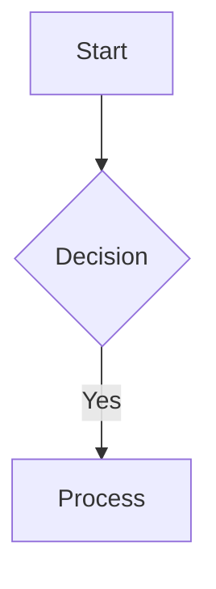

# Features

A guided tour of every feature in VaultReader, with the syntax / shortcut to invoke each.

## Reading

### Vault browser
Each subdirectory of the mounted `/vaults` path is a separate vault. The sidebar shows them as icons (top row) — click one to enter. Custom icons go in `appdata/icons/<vault>.{png,svg,jpg,webp}` and are picked up live (no restart).

The sidebar then shows a file-commander style listing for the current directory: folders first (alphabetical), then notes. Click a folder to enter it; click a note to open. Drag the right edge of the sidebar to resize (180–600px); double-click the handle to reset.

### Wikilinks
Standard Obsidian syntax:
- `[[note]]` — links to `note.md` in the current vault.
- `[[note|Custom label]]` — same target, different display text.
- `[[note#heading]]` — link to a heading anchor.
- `[[note^block]]` — link to a block reference (rendered as plain link, no targeting).

Resolution prefers the current vault, then falls back to other vaults (compound key lookup). If a wikilink doesn't resolve, it renders as a "broken link" span you can click to create the missing note.

### Image embeds
- `![[image.png]]` — embed by basename (vault-wide search).
- `![[subdir/image.png]]` — embed by note-relative path.
- `![[full/path/from/vault/root/image.png]]` — embed by vault-relative path.

The renderer rewrites these to `` automatically.

### Backlinks
Toolbar icon (chain-link, top-right). Opens an overlay drawer listing every note in the active vault that links to the current one, with an excerpt of the surrounding context. The badge on the icon shows the count.

### Outline / table of contents
Toolbar icon (three-line list). Opens a 220px right rail with `h1`/`h2`/`h3` headings parsed from the rendered note. The active heading highlights as you scroll. Click any heading to smooth-scroll to it. Hidden when the note has no headings; pane state persists per-browser. On screens ≤900px, the pane becomes a fixed-position overlay.

### Note properties
Above the (collapsible) frontmatter section: a one-line strip showing **size · modified (relative; absolute on hover) · word count · outgoing wikilinks · backlinks**. Word count strips frontmatter and code blocks before counting.

### Frontmatter chips
Frontmatter values render below the toggle button. **Array values** (e.g. `tags: [foo, bar]`) and **scalars under tag-like keys** (`tags`, `aliases`, `category`, `categories`, `status`, `topic`, `topics`, `project`, `tag`, `alias`) become rounded chip buttons. Click any chip → opens the search overlay pre-populated with the chip's value.

Non-tag scalars (e.g. `title`, `created`, `public: true`) render as plain text.

### Mermaid diagrams
Fenced code blocks tagged `mermaid` are rendered to SVG client-side via Mermaid v11. Supported: flowchart, sequence, gantt, pie, block, state, class, ER, mindmap, etc. The editor toolbar's 📊 button has a dropdown with five starter scaffolds (flowchart / sequence / gantt / pie / block).



### KaTeX math
Bare `$…$` is **not** consumed (currency conflicts: `costs $5 and $10` would false-match). Use:
- `$$expr$$` — block math.
- `\(expr\)` — inline math.
- `\[expr\]` — alternative block syntax (caveat: goldmark may eat the leading `\` in some contexts; prefer `$$…$$`).

Bad math renders in the accent color rather than throwing.

### Mobile
Sidebar slides in from the left with a scrim backdrop. Toolbar shrinks but stays full-width. Editor toolbar hides under 700px to keep the editor usable. Outline pane becomes a full-width overlay under 700px and auto-closes on heading click.

## Editing

### Edit toggle
Press `E` (no modifier) anywhere outside an input, or click the pencil/eye icon in the toolbar. Switches between rendered preview and CodeMirror 6 editor.

Editor features:
- Line wrapping
- Markdown syntax highlighting (with `oneDark` theme in dark mode)
- Line numbers
- Standard CodeMirror keybindings + `Tab` to indent
- Autosave every 1.5s after typing stops; status indicator at top-right (`Saving… / ✓ Saved / ✗ Error`)
- Conflict-aware save — see "Conflict resolution" below

### Toolbar
14 buttons above the editor:

| Group | Buttons |
|---|---|
| Inline marks | **B**old, *I*talic, ~~strikethrough~~ |
| Block prefixes | **H**eading (cycles 1→2→3→none), bullet list, numbered list, task list, quote |
| Code | inline code (`` ` ``), code block (` ``` `), table (3×3 GFM) |
| Links | hyperlink, wikilink |
| Mermaid | dropdown with 5 starter diagrams |

All buttons are selection-aware: with a selection they wrap or prefix it; with no selection they insert syntax and place the cursor where you'd type next.

### Wikilink autocomplete
Type `[[` in the editor → popup appears below the cursor with up to 8 search results. Arrow keys + Enter to insert; `]` typed by user dismisses. Suppressed inside fenced code blocks.

The popup hits `/api/search?vault=<active>&q=<typed>` with a 150ms debounce. Inserting a result yields `[[vault-relative-path]]` (no `.md` suffix — matches what the renderer expects).

### Paste / drop image upload
Paste an image from the clipboard or drag-drop one onto the editor. The image uploads to `<note-dir>/attachments/<note-base>-<unix>.<ext>` via `POST /api/upload`. While uploading, a `![[uploading-<ts>]]` placeholder sits at the cursor; on success it's replaced with `![[attachments/<filename>]]`.

Reuses the same `isWritable` + `safePath` guards as note PUTs. Caps body at 10MB. Accepts `image/{png,jpeg,gif,webp,svg+xml}`. Files in unwritable paths return 403, surfaced via a modal.

### Conflict-aware writes
On save, the client sends `?ifMTime=<last-known-mtime>` along with the body. If the file on disk is newer (with 1-second slop for second-precision filesystems), the server returns **409 Conflict** with the disk version's content + mtime in the body.

The client surfaces a danger modal:
- **Cancel** — keep editing locally, don't save.
- **Take theirs** — replace the editor with the disk copy (your unsaved edits are lost).
- **Keep mine (overwrite)** — retry the save with the conflict check disabled.

This protects against silent overwrites when Syncthing brings in changes from another device while you're editing on the web.

## Search & discovery

### Search overlay
`Ctrl/⌘+K` or `/` opens. Backed by a substring match against filename + content (case-insensitive), capped at 20 results per vault. Shows path, title (first H1), and an excerpt.

### Saved searches
Type a query → click "★ Save" → modal asks for a name (default = the query). Up to 30 saved queries kept (LIFO; deduped by name) in `localStorage['vr-saved-searches']`. Empty-state of the search overlay shows the saved list with click-to-run.

### Tag pane
Toolbar icon (price-tag). Opens a 600px overlay listing every frontmatter tag across all vaults, sorted by count desc. Filter input narrows the cloud live. Click any tag → closes the pane and opens search with that tag as the query. Tooltip shows which vaults the tag appears in.

Currently aggregates `tags:` and `tag:` keys from frontmatter only — inline `#tag` syntax is not yet detected.

### Graph view
Toolbar icon (three-circles). Full-screen overlay with a Cytoscape force-directed graph. Each node is a note; each edge is a wikilink. Per-vault filter dropdown defaults to the active vault but can be set to "All vaults". Node size scales with incoming reference count; nodes with refs get the accent color. Click any node to close the graph and jump to that note.

The graph endpoint reuses the in-memory wikilink index; recomputed on every open.

### Daily notes
`Ctrl/⌘+D` → opens or creates `daily/YYYY-MM-DD.md` in the active vault. New notes get a minimal `# YYYY-MM-DD` template. Idempotent — second invocation just opens the existing note.

### Pinned notes
Add `pinned: true` to a note's frontmatter. Next time you open the note, it joins a per-vault pin list (`localStorage['vr-pinned-<vault>']`). Pinned notes float to the top of the recents list with a 📌 badge, even after dropping out of the recency window.

To unpin: remove the frontmatter line.

## Sharing

### Share modal
Right-click a note in the sidebar → "Share" (or use the toolbar share icon when the note is open). Pick an expiration (1h / 24h / 7d / 30d / never) and an optional label, then "Generate link". Toggle "Allow editing" to make the share writable (rare).

The link is signed with a per-server admin token and looks like:
```
https://notes.example.com/share/<24-char-token>
```

If you proxy `notas/<token>` to `/share/<token>` in Traefik (or similar), shorter custom URLs work.

### Active shares (Settings → Shared tab)
Lists every active link. Each row: vault/path, badges (edit / ro, expiration), label, copy button, revoke button. **"Revoke all"** at the top clears every active link in one go (with a danger confirm).

The server-side filter in `handleShareList` already hides expired entries from this view (they're functionally gone — they can't be redeemed — but still occupy space in `shares.json` until the file is rewritten).

## File operations

### Create / rename / delete
- Right-click a folder → New note / New folder / Rename / Delete.
- Or use the `+` button at the top of the file list for the current directory.
- `Ctrl/⌘+N` creates a new note via prompt.

Deletes are **soft** by default — the file moves to `<vault>/.trash/`. Permanent delete from there.

### Move
Right-click → Move. Opens the move-picker: pick a target folder via tree, click "Move here". Path resolution preserves directory ↔ note distinction.

### Trash (Settings → Trash tab)
Aggregated across all vaults; each row tagged with its origin vault. **Restore** moves the file back to its original location and re-indexes it. **Delete** permanently removes. **Empty all** clears every vault's `.trash/` (danger confirm).

### Attachments (Settings → Attachments tab)
Per-vault picker + filter (All / Orphans only). Lists every image file with size, modified, ref count. **Orphans** (refCount=0) get an accent border and red tag; **Delete all orphans** moves them all to trash with one click.

Reference detection scans every `.md` file for path-suffix matches against the image:
- `![[basename.ext]]` — basename
- `![[some/suffix.ext]]` — any path suffix
- `` — standard markdown
- Variants without the extension

This catches Obsidian's note-relative `![[subdir/foo.png]]` syntax as well as full-path references.

## Operations

### Settings (Settings → General tab)
- Dark mode toggle
- Sidebar width: Reset (clears `localStorage['vr-sidebar-w']`)

### Admin (Settings → Admin tab)
Requires `admin_token` set in `appdata/config.json`. The browser must include `X-Admin-Token` header — currently only achievable via direct curl; the in-browser admin tab returns 403 unless a token is configured. See [docs/security.md](security.md).

When working: lists RW paths, lets you add/remove. Restart container button (calls `/api/admin/restart` which re-execs the binary).

### About
Version, repo link, total vaults / total notes count.

## Integrations

### WebDAV-out
Read-only WebDAV at `/webdav/`. Method allowlist: `GET`, `HEAD`, `OPTIONS`, `PROPFIND`. All mutating verbs return 405. Use case: point Obsidian Mobile or any WebDAV client at `https://notes.example.com/webdav/<vault>/` to browse + read your notes when the bespoke `/api/note` JSON protocol isn't speakable.

The endpoint exposes the entire vaults dir, including `.obsidian/`, `.trash/`, `.smart-env/`. Filter at your reverse proxy if you want to hide them.

### Syncthing status
Set `SYNCTHING_API_KEY` and `SYNCTHING_API_URL` env vars. The status bar shows a colored dot:
- Green = Up to date
- Amber + percentage = Syncing
- Red = Error / unreachable

Polled every 10s.

### Health
`GET /health` → `200 OK` with body `OK`. Plain check, no auth, no work — wire it into your container orchestrator's liveness probe.

### Rate limit
Per-IP, 240 requests/minute, sliding window. Honors `X-Real-IP` and `X-Forwarded-For` (left-most hop) when set, so behind Traefik you get real per-user buckets instead of a shared bridge bucket.
