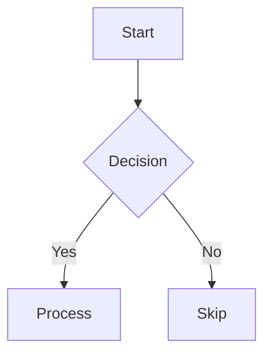

# Syntax reference

Every markup format VaultReader understands when rendering a note.

## Markdown core (GFM)

Anything GitHub Flavored Markdown supports works:
- Headings `# … ######`, with auto-IDs (`# Foo Bar` → `id="foo-bar"`).
- Bold `**…**`, italic `*…*`, strikethrough `~~…~~`.
- Lists (bullet, numbered, nested).
- Task lists `- [ ]`, `- [x]`.
- Blockquotes `> …`.
- Inline code `` `…` `` and fenced code blocks ` ```lang … ``` `.
- Tables (GFM pipe syntax).
- Links `[text](url)`.

Unsafe HTML pass-through is enabled — raw `<div>`, `<details>`, etc. render as-is.

## Wikilinks

Standard Obsidian syntax. Supported forms:

| Syntax | Resolves to |
|---|---|
| `[[note]]` | `note.md` in active vault, falling back to other vaults |
| `[[note|alias]]` | Same target, displayed as "alias" |
| `[[path/to/note]]` | Vault-relative path |
| `[[note#heading]]` | Heading anchor (links to `note.md#heading`) |
| `[[note^block]]` | Block reference (renders as plain link to `note.md`; no targeting) |
| `[[ ]]` *(empty)* | Renders as broken-link span |

Unresolved links render as a `<span class="missing-link">` styled in the accent color — click to create the missing note (when in edit mode).

Resolution order:
1. Exact compound key: `<active-vault>:<normalized-name>`.
2. Bare normalized name (any vault).
3. Path-prefix match within active vault.

Normalization: lowercase, strip `.md` extension.

## Image embeds

```
![[image.png]]                 → basename match (vault-wide)
![[subdir/image.png]]          → note-relative path (Obsidian's default for pasted images)
![[full/path/image.png]]       → vault-relative path
  → standard markdown image
```

Resolution mirrors wikilinks but only against image extensions: `.png`, `.jpg`, `.jpeg`, `.gif`, `.webp`, `.svg`, `.bmp`, `.avif`. Fallback chain prefers note-directory siblings first.

The renderer rewrites the embed to:
```html
&path=<resolved>" alt="...">
```

## Frontmatter

YAML at the top of a note. Standard form:
```yaml
---
title: My Note
tags: [work, urgent, q2-2026]
aliases:
  - Other name
  - alt-name
created: 2026-04-29
status: active
pinned: true
public: false
---
```

VaultReader parses with `gopkg.in/yaml.v3`. Failure to parse leaves the YAML block intact in the rendered body but exposes an empty `frontmatter: {}` to the client. (No error surfaced in the UI — be careful with quoting.)

### Special keys

| Key | Effect |
|---|---|
| `title` | Used as the note's display title (falls back to first H1 then filename) |
| `pinned: true` | Floats the note to the top of recents with a 📌 |
| `tags`, `tag`, `aliases`, `alias`, `category`, `categories`, `topic`, `topics`, `status`, `project` | Rendered as clickable chips in the frontmatter panel; click → opens search |

Other keys render as plain text or chips (if array-typed) in the collapsible frontmatter panel.

### Tag aggregation

The Tags pane (`/api/tags`) collects unique values from `tags:` and `tag:` keys across every note's frontmatter. Both string-array and single-string forms work.

Inline `#tag` in the body is **not yet** detected — only frontmatter tags count.

## Mermaid diagrams

Fenced code blocks tagged `mermaid` are rendered to SVG client-side via Mermaid v11.



Supported diagram types (any v11-supported type works):
- `flowchart` (alias `graph`)
- `sequenceDiagram`
- `gantt`
- `pie`
- `block` (v11+ only)
- `stateDiagram-v2`
- `classDiagram`
- `erDiagram`
- `journey`
- `mindmap`
- `quadrantChart`

The editor toolbar's 📊 button has a dropdown with five starter scaffolds (flowchart, sequence, gantt, pie, block) for the most common cases.

If a diagram fails to parse, the error is rendered in the accent color in place of the diagram instead of breaking the page.

## Math (KaTeX)

Bare `$…$` is **not** consumed (currency conflicts). Use these delimiters:

| Delimiter | Inline / Block | Status |
|---|---|---|
| `$$expr$$` | block | ✓ works |
| `\(expr\)` | inline | ✓ works |
| `\[expr\]` | block | ✗ doesn't work — goldmark eats the leading `\` in some contexts |
| `$expr$` | inline | ✗ disabled (would false-match `$5 and $10`) |

Recommended: **`$$…$$` for blocks**, **`\(…\)` for inline**.

```
The Pythagorean theorem: \(a^2 + b^2 = c^2\)

$$\int_0^\infty e^{-x^2}\,dx = \frac{\sqrt{\pi}}{2}$$
```

Bad math renders in the accent color rather than throwing.

KaTeX v0.16.11 is bundled (~1.5MB total: 269KB JS, 23KB CSS, ~1.2MB fonts across TTF/WOFF/WOFF2 variants).

## Search query language

In the search overlay (`Ctrl+K` or `/`), plain text matches name + title + body via substring. Add operators to filter:

| Operator | Example | Meaning |
|---|---|---|
| `tag:` | `tag:work` | Frontmatter tags contain `work`. Substring + hierarchical match (`tag:london` catches `london-2026` and `london/places`). |
| `path:` | `path:viagens` | Vault-relative path contains `viagens`. |
| `title:` | `title:plan` | First-H1 title contains `plan`. |
| `modified:>Nd` / `<Nd` | `modified:>7d` | Modified within last 7 days. Suffixes: `d` (days), `w` (weeks), `m` (months), `y` (years). |
| `modified:>YYYY-MM-DD` | `modified:>2026-01-01` | Modified after this absolute date. |
| `modified:<YYYY-MM-DD` | `modified:<2026-01-01` | Modified before this date. |
| `modified:=YYYY-MM-DD` | `modified:=2026-04-29` | Modified on this date (24h window). |

**Combining:**
- Operators **AND** together: `tag:work modified:>7d` returns notes with `work` tag AND modified within 7 days.
- Plain text after operators acts as the body substring filter: `tag:work london` returns work-tagged notes whose name/title/body contains `london`.
- Operator-only queries (no plain text) return all matching notes sorted by recency.

**Escaping:** values containing spaces or operator characters aren't supported (no quoting yet). Keep operator values single-token.

## Note templates

Drop `.md` files into `<vault>/templates/`. They appear in the toolbar's `+ New` menu under "From template…". Selecting one prompts for a new note name; the template's body is then expanded with these placeholders before creation:

| Placeholder | Replaced with |
|---|---|
| `{{date}}` | Today as `YYYY-MM-DD` (local time) |
| `{{date:FMT}}` | Custom format using `YYYY MM DD HH mm ss` tokens. E.g. `{{date:DD/MM/YYYY HH:mm}}` → `29/04/2026 14:30` |
| `{{time}}` | `HH:mm` |
| `{{title}}` | The new note's name (sans `.md`) |

Example template (`<vault>/templates/Meeting.md`):

```yaml
---
date: {{date}}
time: {{time}}
attendees: []
---

# {{title}}

## Agenda

-

## Notes

```

Templater syntax (`<% tp.date.now(...) %>`) used by Obsidian's plugin is **not** expanded — those tokens render literally. Use the placeholder syntax above for VaultReader-aware templates.

## Code blocks

Fenced with ` ``` ` or ` ~~~ `. Optional language tag for hinting:

````
```python
def hello():
    print("hi")
```
````

VaultReader does **not** highlight code syntax (no Chroma / Prism). The lang tag is preserved on `<pre><code class="language-python">…` so you can apply CSS yourself, but there's no built-in highlighter — code blocks render in the monospace font with subtle background. The exception is `mermaid`, which is intercepted client-side.

## Comments

Obsidian's `%% comment %%` syntax is **not** handled — it renders as plain text.

## Callouts

Obsidian's admonition syntax renders as styled blocks:

```
> [!info] Document Metadata
> File details and metadata here.
> Multi-paragraph body works.

> [!warning] Be careful
> Anything inside the blockquote becomes the callout body.

> [!tip]-
> The trailing `-` (Obsidian fold-start) is accepted but fold state is not preserved.
```

All callout types render with the site accent color (no per-type color coding) — the type is preserved as a `data-callout` attribute on the wrapper if you want to style specific kinds in your own CSS. Title falls back to the type name when omitted (`> [!info]` → "Info"). Same look in shared notes.

## Footnotes

Standard markdown footnotes (`[^1]` / `[^1]: …`) are **not** parsed. Goldmark's footnote extension isn't enabled.

## Highlights

`==highlight==` syntax is **not** handled.

---

## What's planned (not yet implemented)

- Inline `#tag` detection (with tokenizer to skip code blocks / strings)
- Math `\[…\]` block-bracket delimiter (currently broken by goldmark backslash escape)
- Footnotes
- Image dimensions hint `![[foo.png|400]]`

These are tracked as future-work in commits / GitHub issues.
