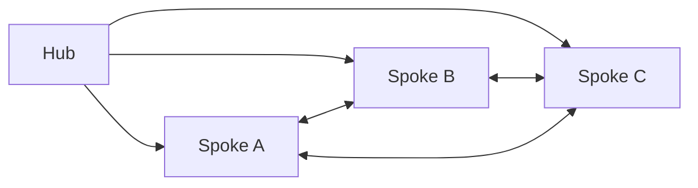

# Spoke B

Another small note. Links back to [[Hub]] and across to [[Spoke A]] and [[Spoke C]].

```mermaid
flowchart LR
  H[Hub] --> A[Spoke A]
  H --> B[Spoke B]
  H --> C[Spoke C]
  A <--> B
  B <--> C
  A <--> C
```

The mermaid diagram above is a static rendering of what the graph view shows dynamically.
