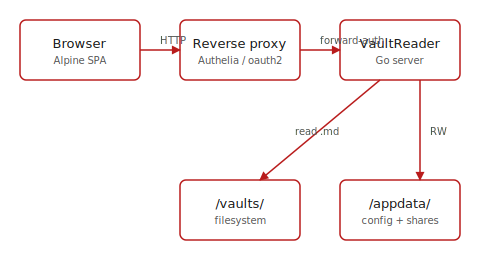
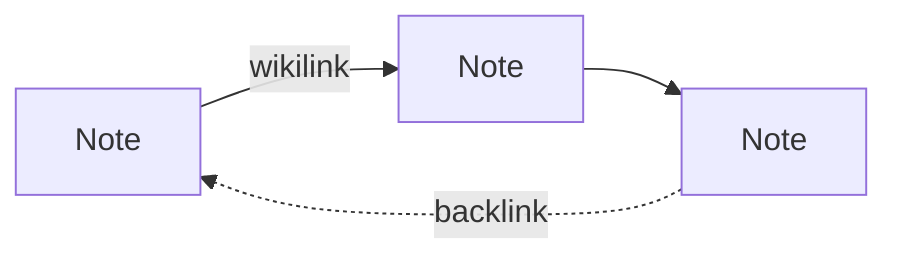
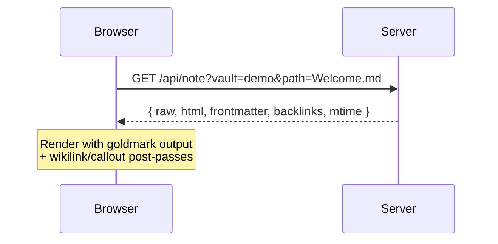

# Syntax showcase

Every renderer feature in one place. Toggle to **Edit** mode to see the markdown source.

## Headings & emphasis

# H1
## H2
### H3

**bold**, *italic*, ~~strikethrough~~, `inline code`, [external link](https://github.com/joaompfp/vaultreader).

## Wikilinks

Cross-vault Obsidian-style links:

- Basic: [[Welcome]]
- With alias: [[Welcome|the welcome page]]
- Path-shaped: [[Linked notes/Hub]]
- Missing target: [[Some Note That Doesn't Exist]] *(renders as a broken-link span — click in edit mode to create)*

## Image embeds

Both Obsidian wikilink-style and standard markdown work:

```
![[assets/banner.svg]]

```

Resolves both forms:

![[assets/banner.svg]]


## Callouts

Obsidian admonition syntax. Type goes in `[!brackets]`, optional title follows:

> [!info] Document Metadata
> Callouts render with a single accent style (matching your site theme), regardless of type.
> The type is preserved as `data-callout="<type>"` if you want per-type CSS overrides.

> [!warning]
> No title is fine — falls back to the type name capitalised.

> [!tip] Use them for context that isn't core content
> File metadata, author notes, status flags, "what to do next" hints.

## Math (KaTeX)

Use `$$…$$` for blocks and `\(…\)` for inline. Bare `$…$` is **not** consumed (avoids currency conflicts):

The Pythagorean theorem: \(a^2 + b^2 = c^2\)

$$\int_0^\infty e^{-x^2}\,dx = \frac{\sqrt{\pi}}{2}$$

## Mermaid diagrams

Fenced code block tagged `mermaid`. Several diagram types supported:





If a diagram fails to parse, the error renders in the accent colour in place of the diagram.

## Tables

Standard GFM pipe tables:

| Feature | Internal preview | Shared note |
|---|---|---|
| Wikilinks | Clickable | Plain styled span |
| Callouts | ✓ | ✓ |
| Math (KaTeX) | ✓ | ✓ (lazy-loaded) |
| Mermaid | ✓ | ✓ (lazy-loaded) |
| Image embeds | ✓ | ✓ (under `/share/<token>/file`) |

## Frontmatter chips

The YAML at the top of this note (`tags: [reference, syntax, demo]`, `status: active`) is rendered as clickable chips in the collapsible properties panel above the title bar. Click a chip → opens search filtered to that value.

Special keys: `title`, `pinned`, `tags`, `aliases`, `status`, `category`, `topic`, `project`.

## Task lists

- [x] Render markdown
- [x] Wikilinks resolve across vaults
- [x] Math + Mermaid + Callouts
- [ ] Footnotes (planned)
- [ ] Inline `#tag` detection (planned)

## Code blocks

```python
def hello():
    print("VaultReader doesn't ship a syntax highlighter — bring your own CSS.")
```

```bash
openssl rand -hex 32  # generate an admin_token
```

The language tag is preserved on `<code class="language-…">` so any third-party highlighter (Prism, Highlight.js) drops in.

## Blockquotes

> Plain blockquotes render as you'd expect.
>
> Multi-paragraph works too.

## Horizontal rules

---

That's everything. See [[Welcome]] to navigate the rest of the demo vault.
